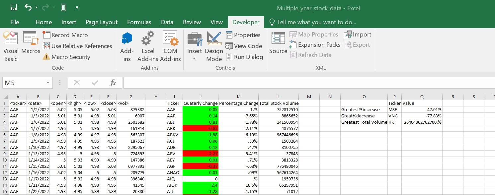

# VBA Analysis

## Website: 
[website](https://github.com/Damiomo/VBA-Analysis)

## Description
Created a script that loops through all the stocks for each quarter and outputs a summary of the information.

## Table of Contents
- [Installation](#installation)
- [Usage](#usage)
- [Credits](#credits)
- [License](#license)
- [Features](#features)
- [Tests](#tests)
- [Contact](#contact)

## Installation
Excel and VBA

## Usage
Run stock.bas module on excel file.

## Credits
Damilare Omoboriowo

## License
MIT

## Features
It provides a summary on stock information.

## Tests
Confirm files are modified with summary data.

## Contact
If there are any questions of concerns, I can be reached at:
##### [github: damiomo](https://github.com/damiomo)
##### [email: domoboriowo14@gmail.com](mailto:domoboriowo14@gmail.com)
